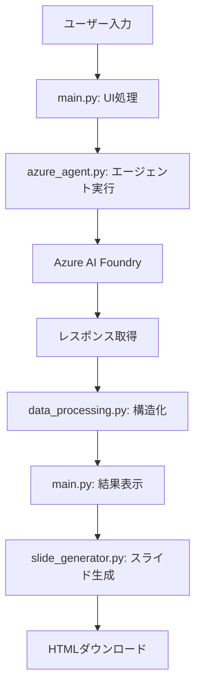

# 🔍 企業・個人調査AIエージェント

Azure AI Foundry の AI エージェントを活用した、企業・個人の包括的調査システムです。調査結果を構造化データとして取得し、プレゼンテーション用HTMLスライドを自動生成します。

## 📋 システム概要

### 🎯 主要機能
- **AI駆動調査**: Azure AI Foundry エージェントによる自動調査実行
- **構造化データ抽出**: 企業基本情報、業界分析、競合比較、トレンド分析
- **HTMLスライド生成**: 4枚構成のプレゼンテーション資料を自動作成
- **リアルタイム進捗表示**: 調査プロセスの可視化
- **エラーハンドリング**: 接続失敗時のフォールバック機能

### 🏗️ アーキテクチャ

```
📁 企業調査AIエージェント
├── 📄 main.py (554行)                    # メインアプリケーション（Streamlit UI）
├── 📁 src/
│   ├── 📄 __init__.py (16行)             # パッケージ初期化
│   ├── 📄 azure_agent.py (298行)         # Azure AI Agent接続・認証・実行
│   ├── 📄 data_processing.py (319行)     # データ抽出・解析・バリデーション
│   └── 📄 slide_generator.py (464行)     # HTMLスライド生成・テンプレート
├── 📁 .streamlit/
│   └── 📄 secrets.toml                   # 認証情報・設定
├── 📄 requirements.txt                   # 依存ライブラリ
└── 📄 README.md                          # 本ドキュメント
```

## 🚀 セットアップ

### 1. 依存関係のインストール
```bash
pip install -r requirements.txt
```

### 2. Azure 認証設定
`.streamlit/secrets.toml` を作成し、以下を設定：

```toml
# Azure AI Foundry Settings
AZURE_AI_ENDPOINT = "your-endpoint"
AZURE_AGENT_ID = "your-agent-id"

# Azure AD Authentication (Service Principal)
AZURE_TENANT_ID = "your-tenant-id"
AZURE_CLIENT_ID = "your-client-id" 
AZURE_CLIENT_SECRET = "your-client-secret"

# Development settings
DEBUG_MODE = true
FORCE_DEFAULT_CRED = true  # DefaultAzureCredential使用時
```

### 3. アプリケーション起動
```bash
streamlit run main.py
```

## 🔧 モジュール詳細

### 📄 main.py (554行)
**責任範囲**: UI制御・セッション管理・ワークフロー統合
- Streamlit UI の構築とレイアウト
- ユーザー入力の受付とバリデーション
- 調査プロセスの進捗表示
- 結果表示とタブ管理
- セッション状態の管理

**主要機能**:
```python
# UI コンポーネント
- 調査対象・観点の入力フォーム
- リアルタイム進捗表示
- 結果表示タブ（概要・詳細・データ・スライド）
- エラー表示とリトライ機能

# セッション管理
- research_results: 調査結果データ
- research_status: 実行状態（ready/processing/completed/error）
- slide_generated: スライド生成状態
```

### 🤖 src/azure_agent.py (298行)
**責任範囲**: Azure AI Foundry との接続・認証・エージェント実行

**主要関数**:
```python
def build_credential():
    """認証情報の構築（SP優先、CLI/ブラウザフォールバック）"""

def call_azure_ai_agent(target, focus_area, specific_requirements):
    """メインのエージェント呼び出し関数"""
    # 1. 認証・接続
    # 2. エージェント・スレッド作成
    # 3. プロンプト送信・実行
    # 4. レスポンス取得・解析
    # 5. 品質スコア計算

def test_connection():
    """接続テスト（最小サンプル相当）"""

def create_fallback_response(target, focus_area, error_reason):
    """エラー時のフォールバックデータ生成"""
```

**認証方式**:
- 最優先: Service Principal (`AZURE_TENANT_ID`, `AZURE_CLIENT_ID`, `AZURE_CLIENT_SECRET`)
- フォールバック: `DefaultAzureCredential` (CLI/VSCode/環境変数)

### 📊 src/data_processing.py (319行)
**責任範囲**: データ抽出・解析・構造化・バリデーション

**主要関数**:
```python
# 安全なデータ取得
def safe_get(data, keys, default): 
def safe_get_list(data, keys, default_list):

# 正規表現ベースの抽出
def extract_year(text):           # 設立年
def extract_employee_count(text): # 従業員数
def extract_revenue(text):        # 売上高
def extract_business_overview(text): # 事業概要
def extract_industry_name(text, target): # 業界名
def extract_challenges(text):     # 課題
def extract_initiatives(text, focus_area): # 取り組み
def extract_best_practices(text): # 先進事例
def extract_trends(text):         # トレンド
def extract_metrics(text):        # メトリクス

# レスポンス処理
def parse_agent_response(agent_response, target, focus_area):
def validate_and_clean_response(parsed_data, target, focus_area):
def extract_structured_data_from_text(text, target, focus_area):
```

### 🎨 src/slide_generator.py (464行)
**責任範囲**: HTMLスライド生成・テンプレート処理・データ反映

**主要関数**:
```python
def generate_html_slides(research_data, target, focus_area):
    """4枚構成のHTMLスライドを生成"""
    # スライド1: 企業概要と主要課題
    # スライド2: 業界構造と市場動向
    # スライド3: 調査観点の取り組み状況
    # スライド4: 先進事例とベンチマーク

def generate_slides_with_html(research_data, target, focus_area):
    """スライド生成のラッパー関数"""
```

**変数化対応**:
- 全ての表示テキストを `research_data` から動的取得
- 直書きテキストを排除し、Agent結果を100%反映
- フォールバック時も適切なデフォルト値を表示

## 📈 データフロー



## 🔍 調査項目

### 📊 企業基本データ
- 正式名称、設立年、従業員数、売上高
- 事業概要、収益構造、事業モデル

### 🏭 業界分析
- 業界名、市場規模、競合Top5企業
- 市場シェア、競争優位性、市場ポジション

### 📈 業界トレンド・市場動向
- 主要トレンド、成長率、破壊的要因
- デジタル変革、技術革新の影響

### ⚠️ 現状課題・問題点
- 組織・技術・市場面での具体的課題
- ビジネスへの影響度評価

### 🎯 調査観点詳細分析
- 現在の取り組み状況、使用ツール
- 定量的効果、業界平均との比較
- 改善ポテンシャル評価

### 🌟 ベストプラクティス・先進事例
- 成功企業の具体的事例と成果
- 海外・国内の分類表示
- 定量的効果の明示

### 📊 業界メトリクス
- 効率改善率、収益向上率
- コスト削減率、生産性向上率

## 🎨 スライド構成

### スライド1: 企業概要と主要課題
- 事業構成と概要
- 現状の主要課題
- 企業データサマリー
- 調査観点の説明

### スライド2: 業界構造と市場動向
- 業界Top5企業（テーブル形式）
- 市場データ（規模・ポジション）
- 業界変化と主要トレンド

### スライド3: 調査観点の取り組み状況
- 対象企業の現状分析
- 業界での位置づけ評価
- 業界先進事例

### スライド4: 先進事例とベンチマーク
- 海外・国内の成功事例
- 定量的効果メトリクス
- 業界関係者の声

## 🔒 認証・セキュリティ

### 認証方式
1. **Service Principal（推奨）**: 安定した自動認証
2. **DefaultAzureCredential**: CLI/VSCode/環境変数から自動選択
3. **Interactive Browser**: 開発時の対話認証

### 必要な権限
- **Azure AI Developer** または **Cognitive Services OpenAI User**
- スコープ: リソースグループまたはワークスペース

### セキュリティ考慮事項
- `.streamlit/secrets.toml` を `.gitignore` に追加
- 本番環境では Azure Key Vault や環境変数を推奨
- 認証情報の定期ローテーション

## 🧪 テスト・デバッグ

### UI テスト
- サイドバー「🧪 Azure接続テスト」
- エラー詳細表示（種別・詳細）
- デバッグ情報表示オプション

## 📊 データ品質管理

### 品質スコア計算
- 必須フィールドの存在確認
- データ完成度の評価（8項目）
- 10点満点での品質評価

### フォールバック機能
- Azure接続失敗時の代替データ
- JSON解析失敗時のテキスト抽出
- 業界別の適応的フォールバック

## 🚀 使用方法

### 基本的な使用手順
1. アプリケーション起動: `streamlit run main.py`
2. ブラウザで `http://localhost:8501` を開く
3. サイドバーで「🧪 Azure接続テスト」を実行（初回のみ）
4. 調査対象と観点を入力
5. 「🚀 AI調査開始」を実行
6. 結果確認後、「📊 スライド生成開始」でHTMLスライドを作成
7. HTMLファイルをダウンロード・プレゼンテーション

### 入力例
- **調査対象**: 株式会社メルカリ、共同通信社、イーロン・マスク
- **調査観点**: 生成AI活用状況、DX推進の取り組み、マーケティング戦略
- **特定要求**: 直近1年の動向、定量データ重視、競合比較詳細

## 🔧 開発・カスタマイズ

### 環境要件
- Python 3.9+
- Streamlit 1.28.0+
- Azure AI Projects SDK
- Azure Identity SDK

### 設定項目
```toml
# .streamlit/secrets.toml
AZURE_AI_ENDPOINT = "..."      # AI Foundry プロジェクトエンドポイント
AZURE_AGENT_ID = "..."         # エージェントID
AZURE_TENANT_ID = "..."        # テナントID（SP使用時）
AZURE_CLIENT_ID = "..."        # クライアントID（SP使用時）
AZURE_CLIENT_SECRET = "..."    # クライアントシークレット（SP使用時）
DEBUG_MODE = true              # デバッグ情報表示
FORCE_DEFAULT_CRED = true      # DefaultAzureCredential強制使用
```

### カスタマイズポイント
- **データ抽出パターン**: `src/data_processing.py` の正規表現パターン
- **スライドテンプレート**: `src/slide_generator.py` のHTML/CSS
- **業界マッピング**: `src/azure_agent.py` の `industry_map`
- **フォールバックデータ**: 接続失敗時の代替情報

## 📊 技術仕様

### システム要件
- **フレームワーク**: Streamlit (Web UI)
- **AI プラットフォーム**: Azure AI Foundry
- **認証**: Azure Identity SDK
- **データ処理**: Pandas, 正規表現
- **出力形式**: HTML, JSON

### パフォーマンス
- **調査時間**: 30-60秒（エージェント処理時間）
- **データ品質**: 10点満点での自動評価
- **スライド生成**: 1-3秒（HTMLテンプレート処理）

### 制限事項
- Azure AI Foundry の利用制限に依存
- 日本語企業・業界情報に最適化
- インターネット接続必須

## 🔍 出力データ構造

### JSON スキーマ
```json
{
  "company_profile": {
    "official_name": "正式企業名",
    "established_year": "設立年", 
    "employees": "従業員数",
    "revenue": "売上高",
    "business_overview": "事業概要",
    "revenue_structure": "収益構造",
    "business_model": "事業モデル"
  },
  "industry_analysis": {
    "industry_name": "業界名",
    "market_size": "市場規模", 
    "market_position": "市場ポジション",
    "top5_companies": [
      {
        "rank": 1,
        "company": "企業名",
        "market_share": "市場シェア",
        "competitive_advantage": "競争優位性"
      }
    ]
  },
  "current_challenges": [
    {
      "specific_issue": "具体的課題",
      "business_impact": "ビジネス影響"
    }
  ],
  "focus_area_analysis": {
    "current_initiatives": [
      {
        "initiative": "取り組み名",
        "results": {"quantitative": "定量効果"}
      }
    ],
    "current_level": "現在のレベル",
    "industry_average": "業界平均",
    "improvement_potential": "改善ポテンシャル"
  },
  "best_practices": [
    {
      "company": "先進企業名",
      "results": "具体的成果"
    }
  ],
  "market_trends": {
    "key_trends": [
      {
        "trend_name": "トレンド名",
        "description": "詳細説明"
      }
    ]
  },
  "industry_metrics": {
    "efficiency_improvement": "効率改善率",
    "revenue_increase": "収益向上率",
    "cost_reduction": "コスト削減率", 
    "productivity_gain": "生産性向上率"
  },
  "industry_voice": "業界関係者の声"
}
```

## 🐛 トラブルシューティング

### 認証エラー
```
DefaultAzureCredential failed to retrieve a token
```
**解決策**:
1. `.streamlit/secrets.toml` にService Principal情報を設定
2. `az login` でCLIログイン
3. テナント権限（Azure AI Developer）の確認

### 接続エラー
```
Agent実行失敗: [エラー詳細]
```
**解決策**:
1. エンドポイントURLの確認
2. エージェントIDの確認  
3. ネットワーク接続の確認
4. Azure AI Foundry サービス状態の確認

### JSON解析エラー
```
JSON解析エラー: [詳細]
```
**解決策**:
- エージェントプロンプトの調整
- フォールバック機能によるテキスト抽出
- デバッグモードでの生レスポンス確認

## 📈 運用・監視

### ログ・監視
- Streamlit 標準ログ
- エラー詳細のUI表示
- 品質スコアによる結果評価

### メンテナンス
- 定期的な認証情報ローテーション
- エージェントプロンプトの最適化
- 業界データパターンの更新

## 🔄 今後の拡張予定

### Phase 2: UI・検証強化
- `src/ui_components.py`: 再利用可能UIコンポーネント
- `src/validators.py`: 高度な入力検証・サジェスト
- `src/utils.py`: 共通ユーティリティ関数

### Phase 3: 設定・テスト充実
- `config/settings.py`: 設定管理の外部化
- `templates/`: HTMLテンプレートの分離
- `tests/`: 単体テスト・統合テスト

### 機能拡張案
- PDF直接出力機能
- 複数企業の一括調査
- 調査履歴の保存・比較
- カスタムテンプレート対応
- API化（REST エンドポイント）

## 📄 ライセンス

本プロジェクトは開発・学習目的で作成されています。
Azure AI Foundry の利用規約に従ってご使用ください。

## 👥 貢献・サポート

- バグレポート: Issues で報告
- 機能要望: Discussion で提案
- コード貢献: Pull Request で提出

---

🔍 **企業・個人調査AIエージェント** | Powered by Azure AI Foundry & Streamlit
